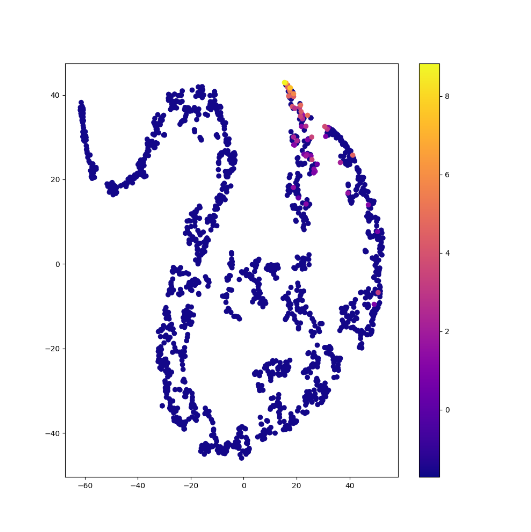
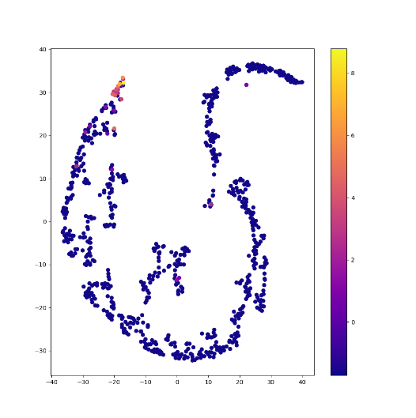

# t-SNE Visualization Tutorial (Regression)

**Full Code:** [view source code](../../../../../../tutorials/SEP-C/regression/imbal_tutorial_tsne_visualization_regression.py)

**Train/Test Files**: [training data](../../../../../../tutorials/data/SEP-C/sep_model_training_regression.csv), [testing data](../../../../../../tutorials/data/SEP-C/sep_model_testing_regression.csv)

---

## 1. Core Code

> This core code is a sample from the `balanced_fit` tutorial code found [here](imbal_tutorial_balanced_fit_regression_clear_sep.md)

```python
import numpy as np
import pandas as pd
import tensorflow as tf
import keras
from tensorflow.keras import layers

import imbal

seed = 42
tf.keras.utils.set_random_seed(
  seed
)

target_column = "ln_peak_intensity"

max_epochs = 300
batch_size = 32

train_data = pd.read_csv("../../../../../../tutorials/SEP-C/regression/sep_model_training_regression.csv")
test_data = pd.read_csv("../../../../../../tutorials/SEP-C/regression/sep_model_testing_regression.csv")

y_train = train_data[target_column].values.reshape(-1, 1).astype("float32")
y_test = test_data[target_column].values.reshape(-1, 1).astype("float32")

x_train = train_data.drop(columns=[target_column]).values.astype(np.float32)
x_test = test_data.drop(columns=[target_column]).values.astype(np.float32)


def build_model(input_shape: int) -> imbal.regression.Model:
  inputs = keras.Input(shape=(input_shape,), name="features")
  hidden1 = layers.Dense(18, activation="relu", name="hidden_layer1")(inputs)
  hidden2 = layers.Dense(12, activation="relu", name="hidden_layer2")(hidden1)
  hidden3 = layers.Dense(8, activation="relu", name="hidden_layer3")(hidden2)
  hidden4 = layers.Dense(6, activation="relu", name="hidden_layer4")(hidden3)
  outputs = layers.Dense(1, name="output_layer")(hidden4)
  built_model = imbal.regression.Model(inputs=inputs, outputs=outputs, name="sep_model")
  return built_model


model = build_model(x_train.shape[1])

labels_kde = y_train.reshape(-1).copy()
kde = imbal.regression.fit_kde(labels_kde)
densities = imbal.regression.get_sample_densities(labels_kde, kde)

model.compile(loss="mean_squared_error",
              optimizer="adam",
              metrics=["mae"],
              )

from imbal.regression import reciprocal_importance

weights = reciprocal_importance(densities, alpha=0.8)
model.balanced_fit(x_train,
                   y_train,
                   sample_weight=weights,
                   batch_size=batch_size,
                   epochs=max_epochs,
                   )
```

---

## 2. t-SNE Visualization

```python
imbal.classification.tsne_visualization(
    model,
    x_train,
    y_train.reshape(-1),
    perplexity=20,
)
```

### Explanation

* **tsne_visualization** projects high-dimensional model representations into 2D space.

* Internally, it extracts intermediate layer outputs (latent features) from the model.

* These latent representations capture how the model "sees" the data.

* **perplexity** controls how t-SNE balances local vs global structure.

  * Lower values emphasize local clusters; higher values capture broader structure.

* The visualization helps assess:

  * Rare/common separability
  * Feature learning quality
  * Hidden layer structure

---

## 3. Results

### Training Data



### Testing Data



The rare class, noted in yellow/orange, is visibly clustered at the tail end of the representation,
implying the model is learning a solid representation for both common and rare samples.

---