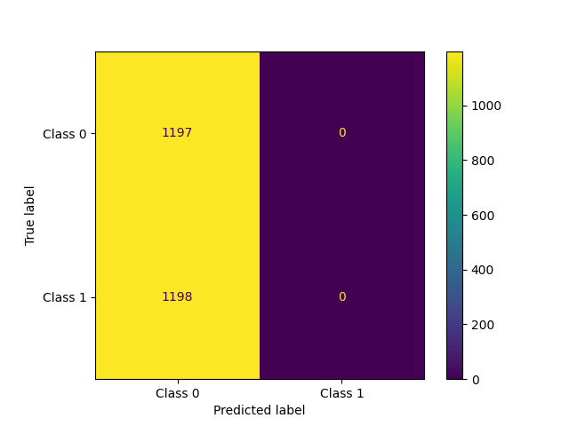
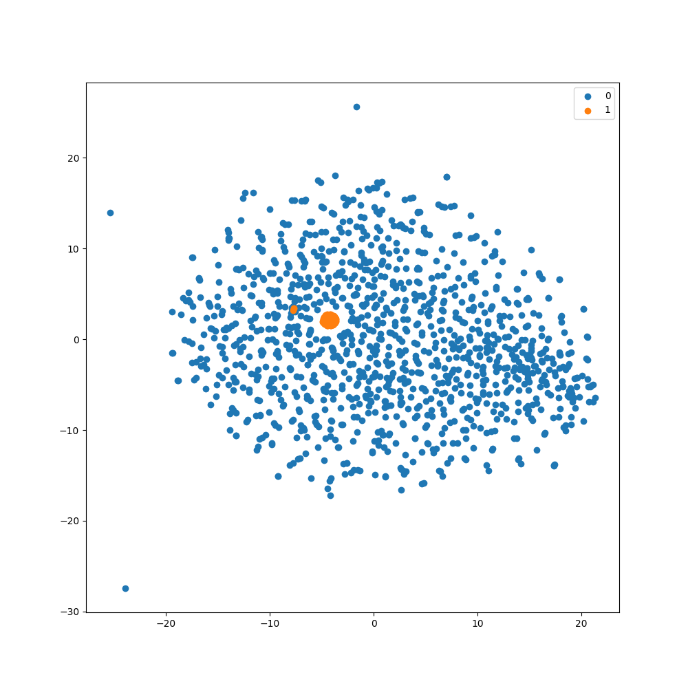
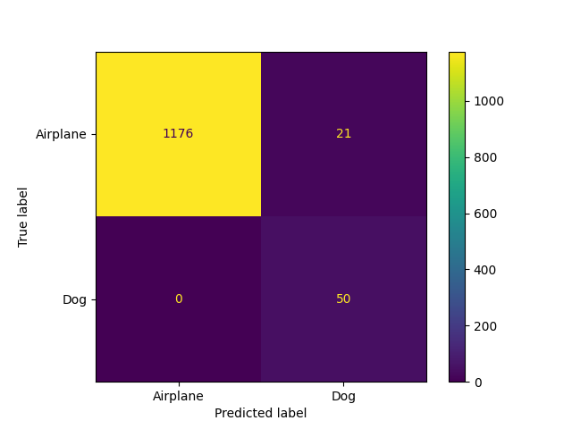
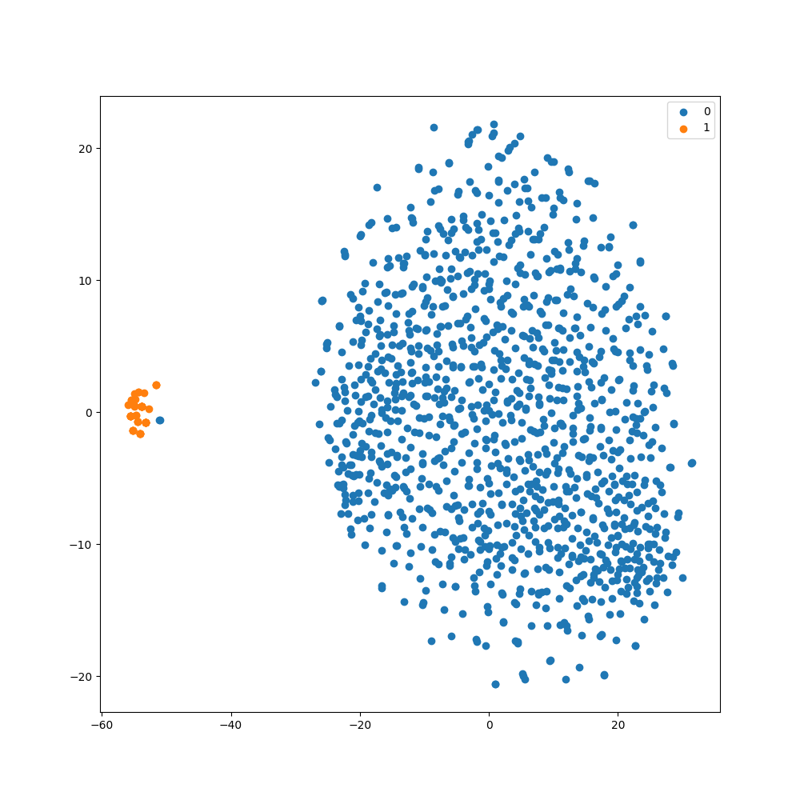
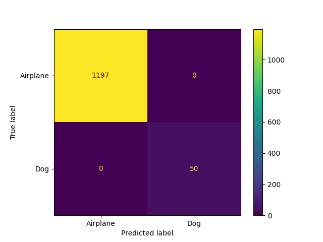
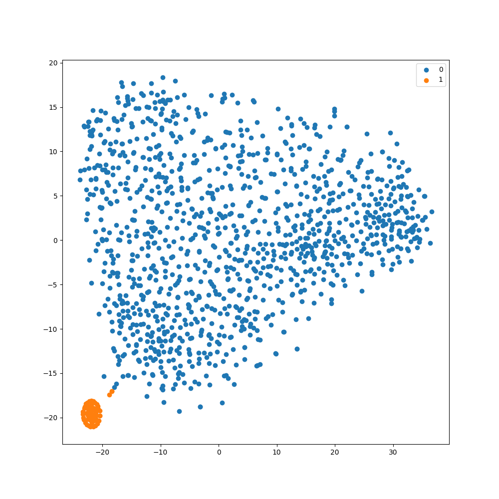

# Comparison of Methods: Regular vs. Balanced vs. Decoupled Fit

Below is a comparison of [decoupled fit](decoupled_fit.md) and [balanced fit](balanced_fit.md)
to a standard, unbalanced fit, and a weight-balanced
fit of a subset of the [CIFAR10 dataset](https://www.cs.toronto.edu/~kriz/cifar.html), picking on the dogs and airplane classes, with an
approximately $1:24$ airplane to dog imbalance.

### Regular Fit

```python
    model.compile(
        loss="categorical_crossentropy",
        optimizer=keras.optimizers.Adam(learning_rate=2e-5),
        metrics=["accuracy", 'F1Score', auc]
    )
    model.fit(
        x_train,
        y_train,
        batch_size=batch_size,
        epochs=epochs
    )
```
#### Regular Fit Results

<div style="display: flex; max-width: 100%; width:650px">


</div>

### Balanced Fit

```python
    parameters = imbal.classification.wrap_model_compile_parameters(
        loss="categorical_crossentropy",
        optimizer=keras.optimizers.Adam(learning_rate=2e-5),
        metrics=["accuracy", 'F1Score', auc]
    )

    imbal.classification.balanced_fit(
        model,
        x_train,
        y_train,
        compile_parameters=parameters,
        epochs=epochs,
        batch_size=batch_size
    )
```

#### Balanced Fit Results

<div style="display: flex; max-width: 100%; width:650px">


</div>

### Decoupled Fit

```python
    parameters = imbal.classification.wrap_model_compile_parameters(
        loss="categorical_crossentropy",
        optimizer=keras.optimizers.Adam(learning_rate=2e-5),
        metrics=["accuracy", 'F1Score', auc]
    )

    imbal.classification.decoupled_fit(
        model,
        x_train,
        y_train,
        compile_parameters=parameters,
        epochs=epochs,
        batch_size=batch_size
    )
```

#### Decoupled Fit Results
    
<div style="display: flex; max-width: 100%; width:650px">


</div>

### Comparison of Performance

| Method    | Time (s) | F1 Score | AUC   |
|-----------|----------|----------|-------|
| Regular   | 9.95     | 0.333    | 0.842 |
| Balanced  | 13.24    | 0.957    | 0.999 |
| Decoupled | 14.05    | 0.983    | 0.989 |
