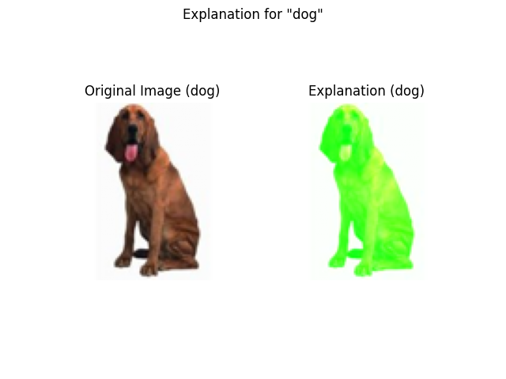
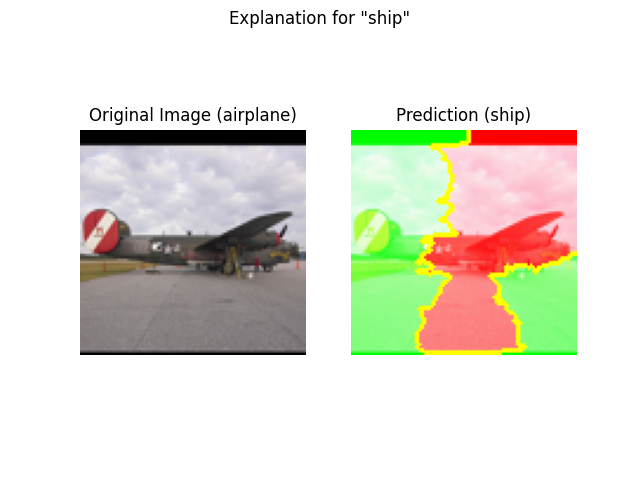
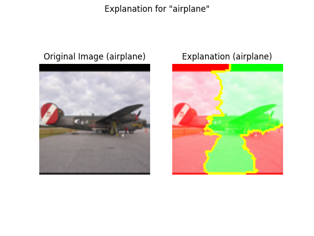

# lime_image_explanation

```{eval-rst}
.. autoclass:: imbal.classification.lime_image_explanation
```

Example:

```python
>>> # Assume a TensorFlow model is already saved to 'model'
>>>
>>> class_labels = ['airplane', 'bird', 'car', 'cat', 'deer',
>>>                 'dog', 'horse', 'monkey', 'ship', 'truck']
>>> 
>>> x = x_test[0]
>>> y = y_test[0]
>>> 
>>> fig, ax = imbal.classification.lime_image_explanation(
>>>     x,
>>>     model,
>>>     actual_label=y,
>>>     label_to_explain=y,
>>>     class_names=class_labels
>>>     return_figure=True
>>> )
```

## Plot Examples

Below is an example of the resulting Matplotlib pyplot plot for a 
correctly predicted class

```python
>>> imbal.regression.explanation.lime_image_explanation(
>>>     x,
>>>     model,
>>>     actual_label=y
>>> )
```



An example of the resulting Matplotlib pyplot plot for in
incorrectly predicted class

```python
>>> imbal.regression.explanation.lime_image_explanation(
>>>     x,
>>>     model,
>>>     actual_label=y
>>> )
```



An example of the resulting Matplotlib pyplot plot for the same
sample shown above, but providing and explanation for the correct class.
From these explanations, we gain insight into the fact that while the
model seems to correctly positively correlate the body of the airplane
with the airpxplane class, the backside of the plane is incorrectly associated
with the ship class, leading to the incorrect prediction.

```python
>>> imbal.regression.explanation.lime_image_explanation(
>>>     x,
>>>     model,
>>>     actual_label=y
>>>     label_to_explain=y
>>> )
```

