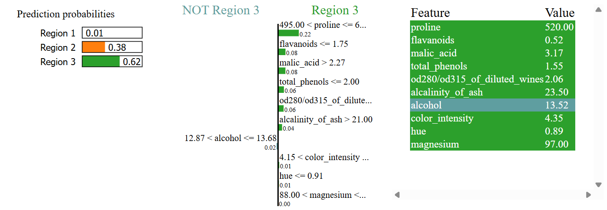

# lime_tabular_explanation

```{eval-rst}
.. autoclass:: imbal.classification.lime_tabular_explanation
```

## Plot Examples

Below is an example of the resulting HTML plot for a sample in the `scikit-learn`.
[wine dataset](https://scikit-learn.org/stable/modules/generated/sklearn.datasets.load_wine.html).

