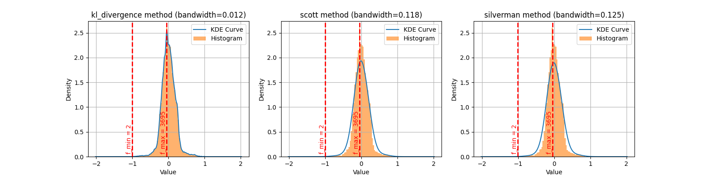
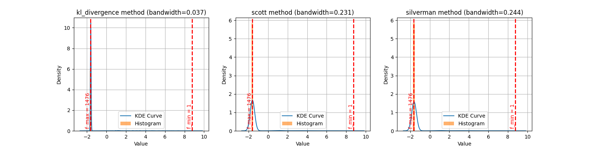
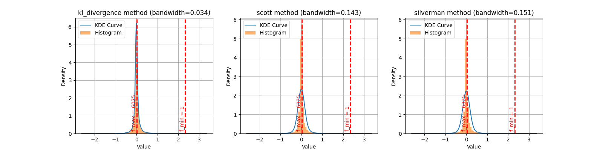

# fit_kde

```{eval-rst}
.. autoclass:: imbal.regression.fit_kde
```

## Comparison of Methods in One Dimension

Below is a comparison of the different bandwidth fitting methods
available through `fit_kde` across three datasets. Note that the
`scott` and `silverman` methods are explicit, "rule of thumb" methods
for finding the bandwidth that take $O(n)$ time. The `kl_divergence`
method is an iterative method that takes $O(kn)$ time, where $k$ is
the number of searches performed per iteration, times the number of
iterations.

### Dataset 1 (44,485 data points)



### Dataset 2 (1,531 data points)



### Dataset 3 (16,720 data points)


