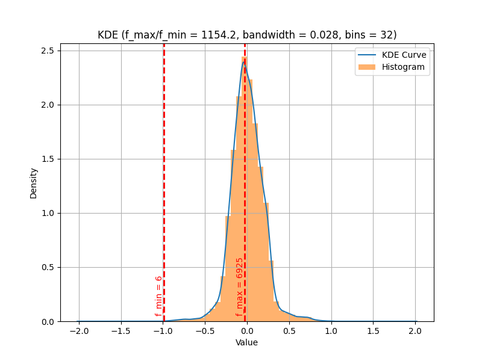
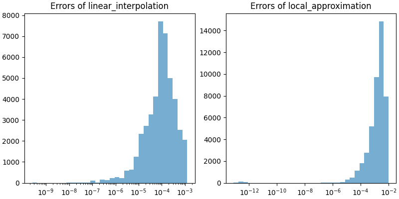
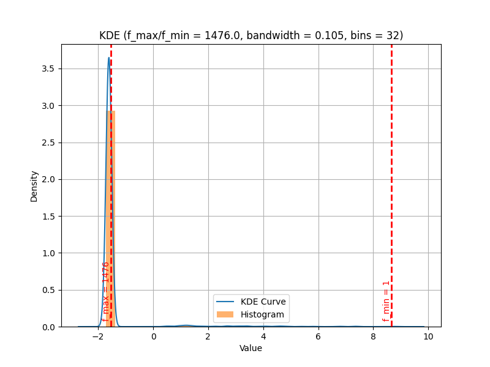
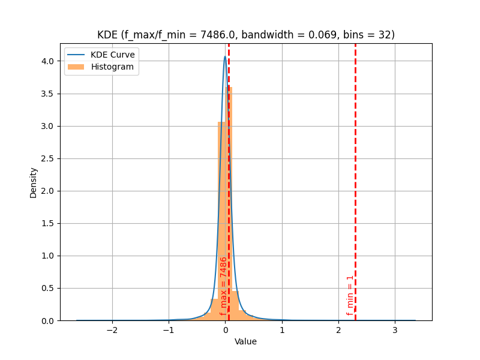
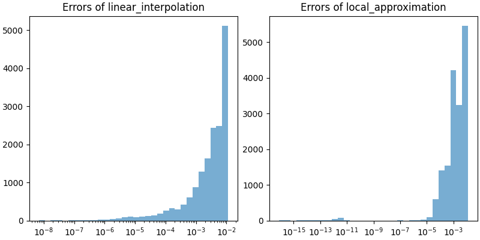

# get_densities

```{eval-rst}
.. autoclass:: imbal.regression.get_densities
```

## Evaluation of Optimizations

The `linear_interpolation` and `local_approximation` optimizations
exist for the `generate_weights`, which greatly decrease the
amount of computation time required to compute density values, at 
the cost of a small amount of error in these values. Below is a
comparison of these two optimization techniques with the regular
full KDE computation across three different datasets.

### Dataset 1 (44,485 data points)

#### Data Distribution



#### KDE Error Distribution



| KDE Optimization Method                     | Compute Time (sec) | MAE            | MAPE      |
|---------------------------------------------|--------------------|----------------|-----------|
| Regular                                     | 44.05              | n/a            | n/a       |
| Linear Approximation (320 bins)             | 0.25               | $1.88*10^{-4}$ | $0.152\%$ |
| Local Approximation (k=320, precision=1e-4) | 0.28               | $2.48*10^{-3}$ | $0.153\%$ |

### Dataset 2 (1,531 data points)

#### Data Distribution



#### KDE Error Distribution


| KDE Optimization Method                     | Compute Time (sec) | MAE             | MAPE     |
|---------------------------------------------|--------------------|-----------------|----------|
| Regular                                     | 0.057              | n/a             | n/a      |
| Linear Approximation (320 bins)             | 0.0029             | $2.00*10^{-2}$  | $0.55\%$ |
| Local Approximation (k=320, precision=1e-4) | 0.012              | $4.56*10^{-13}$ | ~$0\%$   |

### Dataset 3 (16,720 data points)

#### Data Distribution



#### KDE Error Distribution



| KDE Optimization Method                     | Compute Time (sec) | MAE            | MAPE      |
|---------------------------------------------|--------------------|----------------|-----------|
| Regular                                     | 7.33               | n/a            | n/a       |
| Linear Approximation (320 bins)             | 0.064              | $4.81*10^{-3}$ | $0.156\%$ |
| Local Approximation (k=320, precision=1e-4) | 0.014              | $4.0*10^{-3}$  | $0.140\%$ |