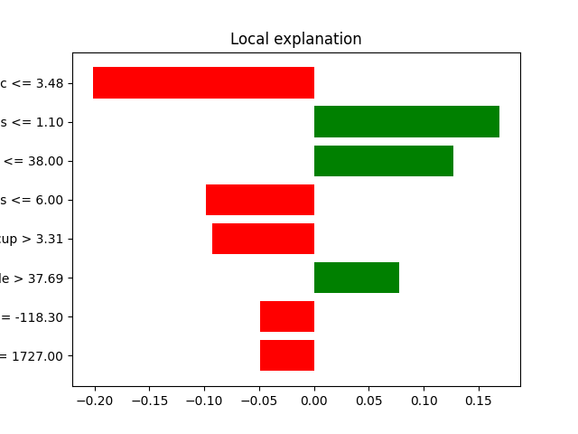

# lime_tabular_explanation

```{eval-rst}
.. autoclass:: imbal.regression.lime_tabular_explanation
```

## Plot Examples

Below is an example of the resulting HTML plot for a sample in the `scikit-learn`.
[California housing dataset](https://scikit-learn.org/stable/modules/generated/sklearn.datasets.fetch_california_housing.html).


Below is the Matplotlib pyplot representation of the same figure shown above. Note that
some of the labels on the left side of the figure are cut off. This is an error in plotting
on LIME's part.

