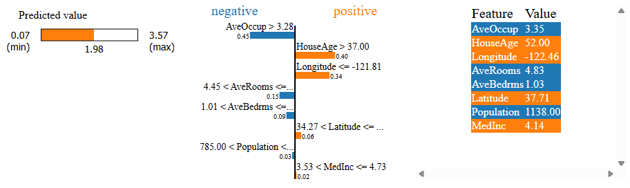
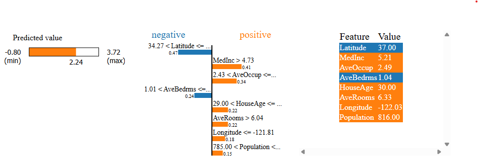
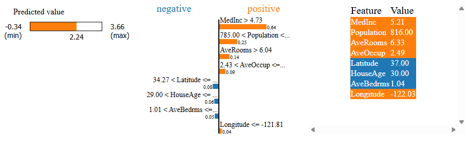

# lime_tabular_explanation

```{eval-rst}
.. autoclass:: imbal.regression.lime_tabular_explanation
```

Example:

```python
>>> # Assume a TensorFlow model is already saved to 'model'
>>>
>>> from sklearn.datasets import fetch_california_housing
>>> 
>>> x, y = fetch_california_housing(return_X_y=True)
>>> labels = fetch_california_housing().feature_names
>>>
>>> imbal.regression.lime_tabular_explanation(
>>>     x[0],
>>>     model,
>>>     x_train,
>>>     label_to_explain=y[0]
>>>     feature_names=labels
>>> )
```

## Plot Examples

Below is an example of the resulting HTML plot for a correctly predicted sample in the `scikit-learn`.
[California housing dataset](https://scikit-learn.org/stable/modules/generated/sklearn.datasets.fetch_california_housing.html).
(Within a reasonable tolerance. The correct label was $2.195$).

```python
>>> imbal.regression.lime_tabular_explanation(
>>>     x,
>>>     model,
>>>     x_train,
>>>     feature_names=labels
>>> )
```



Below is an example of the resulting HTML plot for an incorrectly predicted sample.
(Outside a reasonable tolerance. The correct label was $4.405$).

```python
>>> imbal.regression.lime_tabular_explanation(
>>>     x,
>>>     model,
>>>     x_train,
>>>     feature_names=labels
>>> )
```



Below is an example of the resulting HTML plot for the explanation of the correct class
for the incorrectly predicted sample shown above.

```python
>>> imbal.regression.lime_tabular_explanation(
>>>     x,
>>>     model,
>>>     x_train,
>>>     label_to_explain=y
>>>     feature_names=labels
>>> )
```

