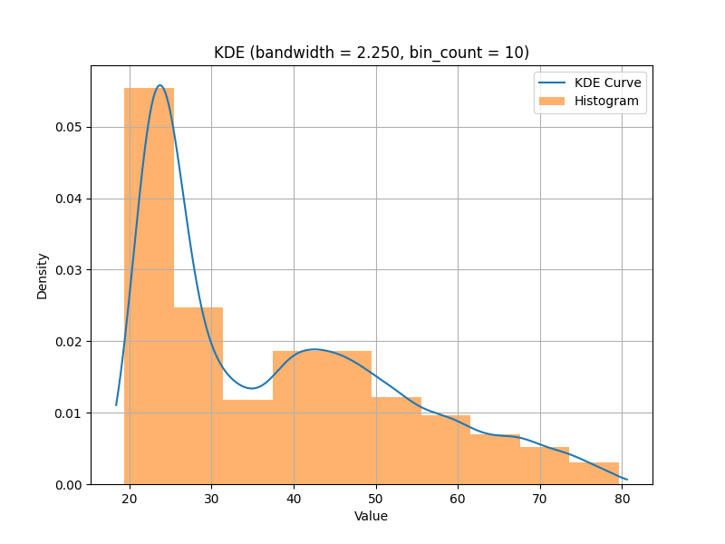
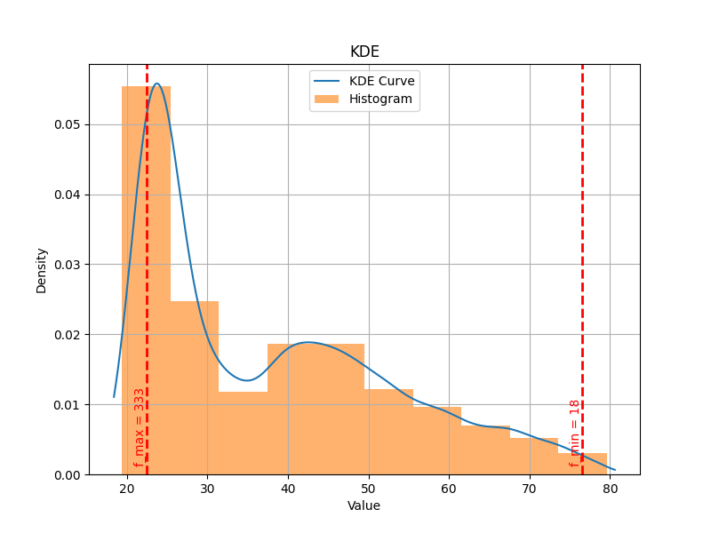

# plot_kde_1d

```{eval-rst}
.. autoclass:: imbal.regression.kde.plot_kde_1d
```

Below is the resultant graph saved to :code:`plot.png`:



Parameters can also be set to modify the values shown on the plot:

```python
>>> found_bandwidth = imbal.regression.fit_kde(data, bin_count=10)
>>> imbal.regression.plot_kde_1d(
>>>     data,
>>>     found_bandwidth,
>>>     bin_count=10,
>>>     save_figure='plot.png',
>>>     show_bin_count=False,
>>>     show_bandwidth=False,
>>>     show_extreme_frequencies=True
>>> )
```

