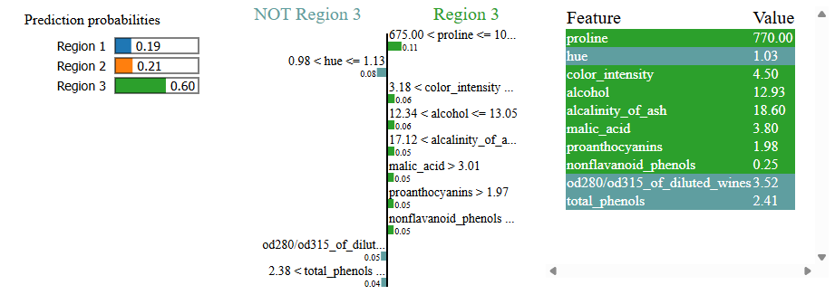
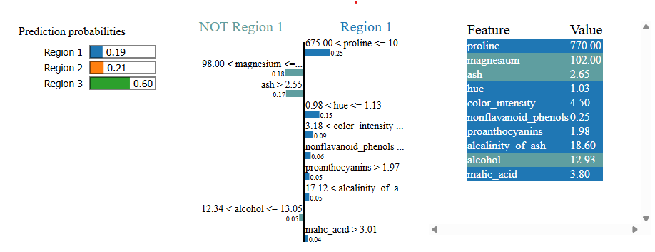

# lime_explain_tabular_sample

```{eval-rst}
.. autoclass:: imbal.regression.shap_explain_tabular_sample
```

Example:

```python
>>> # Assume a TensorFlow model is already saved to 'model'
>>>
>>> from sklearn.datasets import load_wine
>>> 
>>> x, y = load_wine(return_X_y=True)
>>> labels = load_wine().feature_names
>>>
>>> imbal.classification.lime_tabular_explanation(
>>>     x[0],
>>>     model,
>>>     x_train,
>>>     label_to_explain=y[0],
>>>     class_names=['Region 1', 'Region 2', 'Region 3'],
>>>     feature_names=labels
>>> )
```

## Plot Examples

Below is an example of the resulting HTML plot for a correctly predicted sample in the `scikit-learn`
[wine dataset](https://scikit-learn.org/stable/modules/generated/sklearn.datasets.load_wine.html).

```python
>>> imbal.classification.lime_tabular_explanation(
>>>     x,
>>>     model,
>>>     x_train,
>>>     class_names=['Region 1', 'Region 2', 'Region 3'],
>>>     feature_names=labels
>>> )
```


Below is an example of the resulting HTML plot for an incorrectly predicted sample.

```python
>>> imbal.classification.lime_tabular_explanation(
>>>     x,
>>>     model,
>>>     x_train,
>>>     class_names=['Region 1', 'Region 2', 'Region 3'],
>>>     feature_names=labels
>>> )
```



Below is an example of the resulting HTML plot for the explanation of the correct class
for the incorrectly predicted sample shown above.

```python
>>> imbal.classification.lime_tabular_explanation(
>>>     x,
>>>     model,
>>>     x_train,
>>>     label_to_explain=y,
>>>     class_names=['Region 1', 'Region 2', 'Region 3'],
>>>     feature_names=labels
>>> )
```

